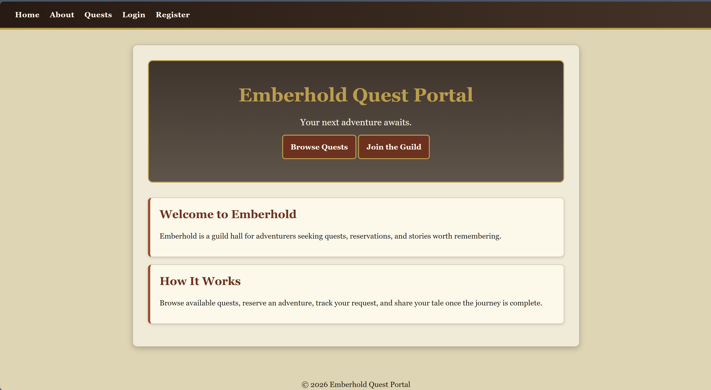
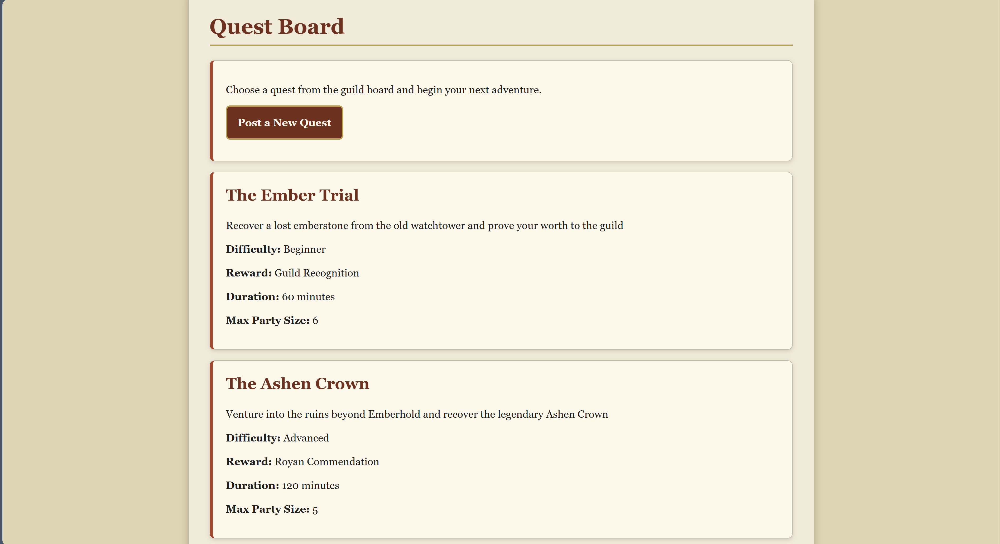
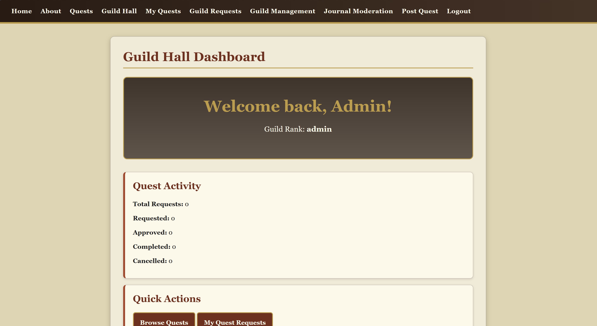
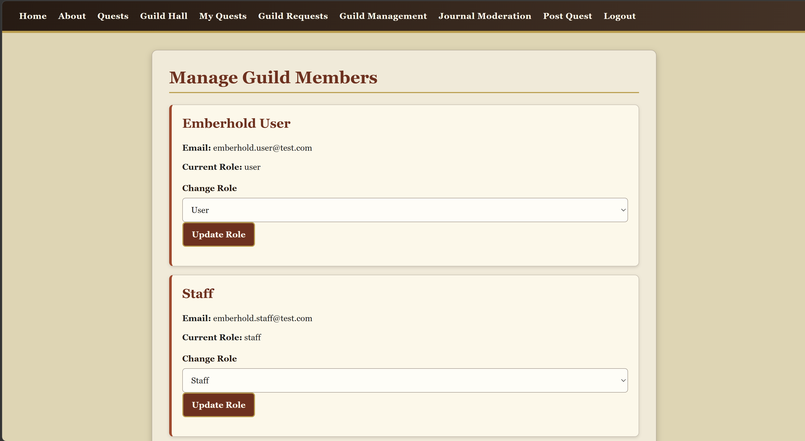
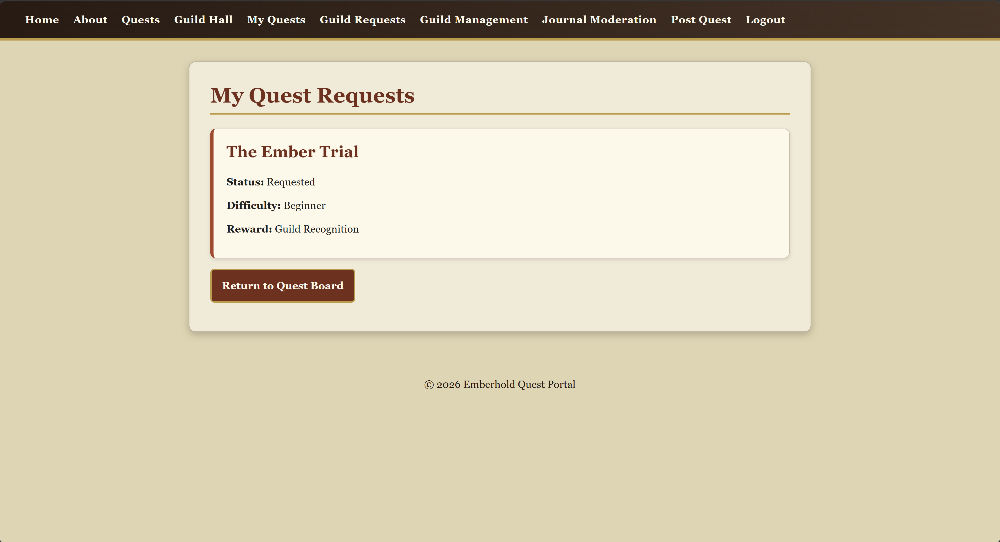
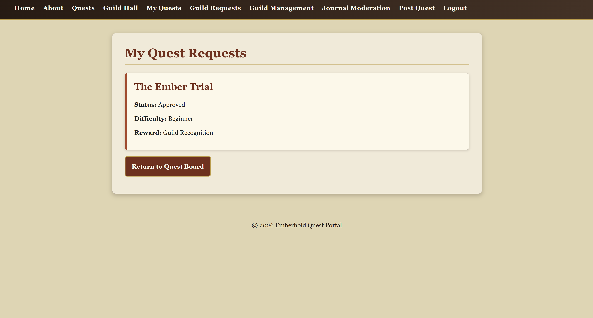
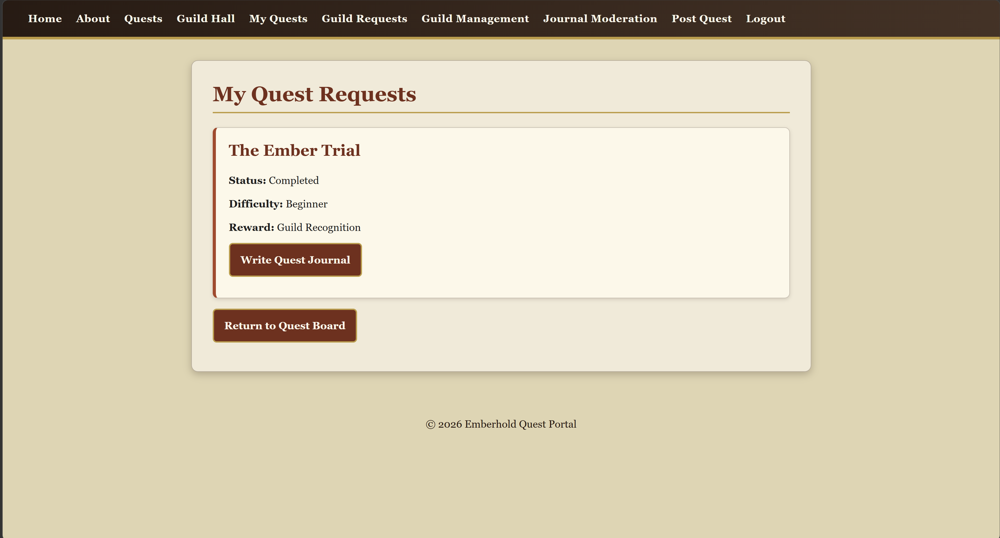
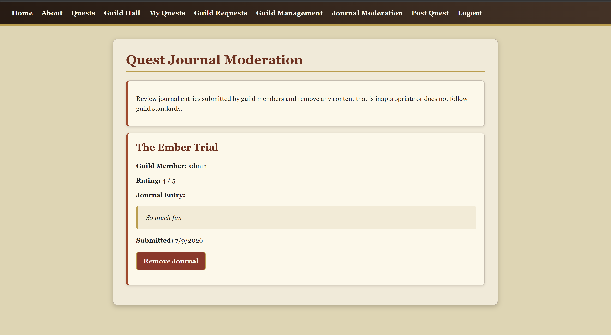
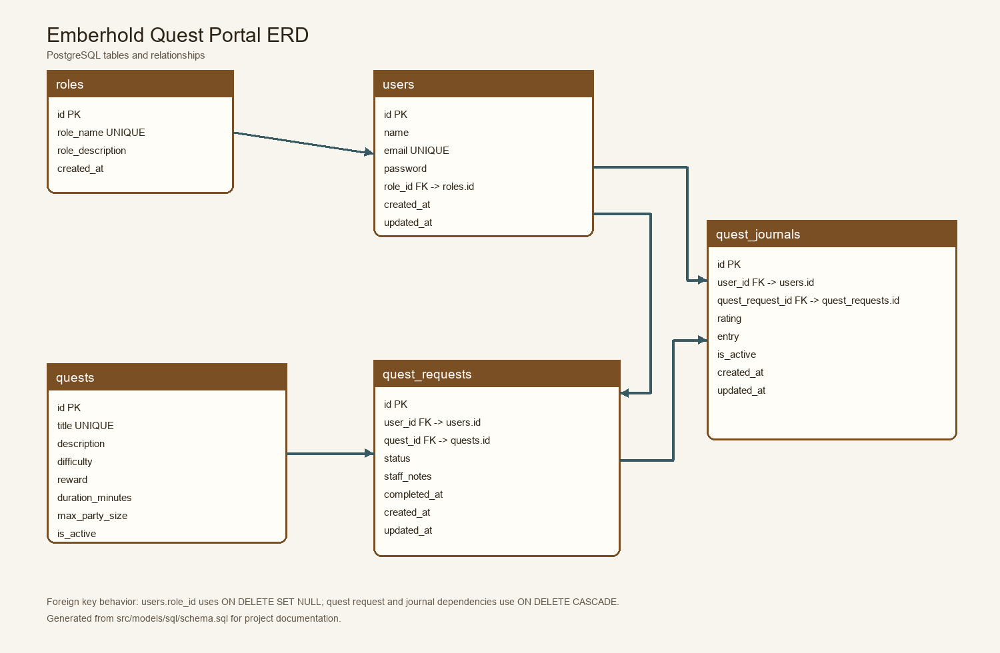

# Emberhold Quest Portal

*A medieval-inspired quest reservation and guild management system built with Node.js, Express, PostgreSQL, EJS, and Render.*

---

# Project Description

Welcome to Emberhold!

Emberhold Quest Portal is a medieval-inspired web application that I created as my final project for CSE 340 Web Backend Development at BYU–Idaho.

Rather than creating a traditional business application, I wanted to build something people could imagine actually using. I've always enjoyed medieval worlds and immersive experiences, so creating Emberhold gave me the opportunity to combine those interests while applying everything I learned throughout this course.

Guild members can create accounts, browse available quests, request adventures, follow their progress through a multi-stage workflow, and record completed journeys in their personal Quest Journal.

Guild staff members help manage incoming quest requests while guild administrators oversee the guild by managing quests, user roles, and community journal entries.

Although this project was created to demonstrate backend development concepts, it also represents the beginning of a much larger immersive medieval experience that I hope to continue developing in the future.

---

# Why I Chose This Project

I have always enjoyed creating immersive experiences and wanted a project that allowed me to practice backend development while building something meaningful to me.

Designing Emberhold allowed me to combine database design, authentication, user management, workflows, and dynamic content into a project that feels like a real application instead of simply completing assignment requirements.

Building this project challenged me to think differently about application architecture and gave me much more confidence working with Express, PostgreSQL, MVC, authentication, validation, deployment, and debugging real-world problems.

It was exciting to watch the project grow from a simple idea into a complete web application that I can continue improving long after this class ends.

---

# Live Application

🔗 https://emberhold-quest-portal.onrender.com

---

# GitHub Repository

🔗 https://github.com/jkulmus/emberhold-quest-portal

---

# Application Preview

The screenshots below walk through the Emberhold Quest Portal from the perspective of both guild members and administrators, highlighting the major features and workflow of the application.

## Home Page

The landing page welcomes visitors to Emberhold and provides access to the Quest Board, registration, and login.



---

## Quest Board

The Quest Board displays all available quests stored in the PostgreSQL database. Guild members can browse quests and view detailed information before requesting an adventure.



---

## Guild Dashboard

After logging in, guild members are taken to their personal dashboard where they can manage quests, monitor their progress, and access features based on their role.



---

## Guild Management

Administrators have access to guild management tools that allow them to manage users, assign roles, create quests, and oversee the Emberhold community.



---

## Quest Workflow

One of the core features of Emberhold is the quest request workflow. Guild members can easily follow the progress of their adventures from submission through completion.

### 1. Quest Requested

After selecting a quest from the Quest Board, the request is submitted and appears with a **Requested** status while awaiting guild approval.



---

### 2. Quest Approved

Guild staff review incoming requests and approve adventures that are ready to begin. Guild members immediately see the updated status.



---

### 3. Quest Completed

Once the quest has been completed, guild members can write a personal Quest Journal entry documenting their adventure and rating their experience.



---

## Journal Moderation

Administrators can moderate community journal entries when necessary by reviewing submissions and removing inappropriate content.



---

# Features

## Guests

- Browse the Quest Board
- View quest details
- Register for a guild account
- Login

## Registered Guild Members

Guild members can:

- Browse available quests
- Request quests
- Track quest request status
- View quest history
- Create Quest Journal entries
- Edit personal journal entries
- Delete personal journal entries

## Guild Staff

Staff members can:

- View all Guild Requests
- Approve quest requests
- Update quest request statuses
- Complete or cancel quests

## Guild Administrators

Administrators have full control of the guild and can:

- Create quests
- Edit quests
- Delete quests
- Manage user roles
- Moderate Quest Journal entries
- Access all staff features

---

# Technology Stack

- Node.js
- Express.js
- PostgreSQL
- EJS
- ECMAScript Modules (ESM)
- Express Session
- connect-pg-simple
- bcrypt
- express-validator
- pnpm
- Render

---

# Skills Demonstrated

This project demonstrates:

- MVC Architecture
- Server-side rendering with EJS
- PostgreSQL database relationships
- Session-based authentication
- Password hashing with bcrypt
- Role-based authorization
- Dynamic routing
- Parameterized SQL queries
- Form validation
- Flash messaging
- Global error handling
- Dynamic content management
- User-generated content
- Multi-stage workflow management
- Administrative dashboards
- Production deployment using Render

---

# MVC Architecture

The project follows the Model-View-Controller (MVC) design pattern.

```
src
├── controllers
├── middleware
├── models
├── routes
└── views

public
└── css
```

Models manage database communication, controllers handle business logic, routes connect incoming requests to the appropriate controllers, middleware manages authentication, authorization, validation, flash messaging, and error handling, while EJS views render the user interface.

Organizing the project this way keeps the application easier to maintain, extend, and understand.

---

# Database Schema

The application uses a normalized PostgreSQL database with multiple related tables.

Each table has a specific responsibility and is connected through foreign-key relationships to reduce duplicated data and maintain referential integrity.

Primary tables include:

- Roles
- Users
- Quests
- Quest Requests
- Quest Journals

Relationships include:

- One Role → Many Users
- One User → Many Quest Requests
- One Quest → Many Quest Requests
- One User → Many Quest Journal Entries
- One Quest Request → Many Journal Entries



This schema demonstrates the normalized database structure used throughout the application and the relationships that support authentication, quest management, workflow tracking, and journal entries.

---

# User Roles

## Standard User

- Register and login
- Browse quests
- Request quests
- Track quest status
- Create, edit, and delete personal Quest Journal entries

## Staff

All Standard User permissions plus:

- View Guild Requests
- Approve requests
- Update request statuses
- Complete or cancel quests

## Administrator

All Staff permissions plus:

- Create quests
- Edit quests
- Delete quests
- Manage user roles
- Moderate Quest Journals

---

# Multi-Stage Workflow

Quest requests move through the following workflow:

```
Requested
      ↓
Approved
      ↓
Completed
```

Requests may also be cancelled when necessary.

Guild members can monitor the current status of their requests through the **My Quests** page, while staff members and administrators update those statuses through the **Guild Requests** page.

---

# User Interaction

Guild members can create Quest Journal entries after completing quests.

Each journal entry contains:

- Rating
- Written adventure summary
- Date created

Users can:

- View their own journal entries
- Edit their own journal entries
- Delete their own journal entries

Administrators can moderate journal entries by removing inappropriate content when necessary.

---

# Security

Security features include:

- Password hashing using bcrypt
- Session-based authentication with Express Session
- Role-based authorization
- Protected routes
- Parameterized SQL queries to prevent SQL injection
- Server-side validation using express-validator
- Environment variables for sensitive configuration
- `.env` excluded from Git version control
- Secure production deployment on Render

---

# Test Accounts

| Role | Email |
|------|-------|
| Administrator | emberhold.admin@test.com |
| Staff | emberhold.staff@test.com |
| Standard User | emberhold.user@test.com |

All test accounts use the common password required by the course assignment

---

# Local Installation

Clone the repository:

```bash
git clone https://github.com/jkulmus/emberhold-quest-portal

cd emberhold-quest-portal
```

Install dependencies:

```bash
pnpm install
```

Create a `.env` file:

```env
NODE_ENV=development
PORT=3000
DB_URL=your_postgresql_connection_string
SESSION_SECRET=your_session_secret
```

Run the application:

```bash
pnpm start
```

Development mode:

```bash
pnpm dev
```

---

# Known Limitations

Current limitations include:

- Journal moderation currently supports removal instead of more advanced moderation tools.
- Quest categories and images are planned for a future version of Emberhold.
- Additional workflow stages such as **In Progress** could be added in future updates.
- Additional accessibility improvements could still be made.

---

# Future Improvements

If I continue developing Emberhold, I would like to add:

- Quest images
- Quest categories and advanced filtering
- Guild achievements and badges
- Quest scheduling
- Guild messaging between members and staff
- Expanded journal moderation tools
- Additional workflow stages
- Expanded kingdoms inspired by the larger Phenixgard world
- More immersive story-driven adventures

---

# Final Thoughts

This project represents everything I learned throughout CSE 340. It challenged me to combine authentication, authorization, database design, MVC architecture, server-side rendering, validation, and deployment into one complete application.

The most rewarding part of this project was watching it grow from a simple idea into a fully deployed web application. Every new feature built on the previous one, and by the end of the course I had created something that feels like a real application instead of just another assignment.

This project gave me the opportunity to build something I genuinely enjoyed creating. While there are many additional features I hope to add in the future, I am proud of what I accomplished and excited to continue expanding Emberhold well beyond the classroom.

---

# Author

**Jacquelyn Kulmus**

CSE 340 Web Backend Development

BYU–Idaho

2026
